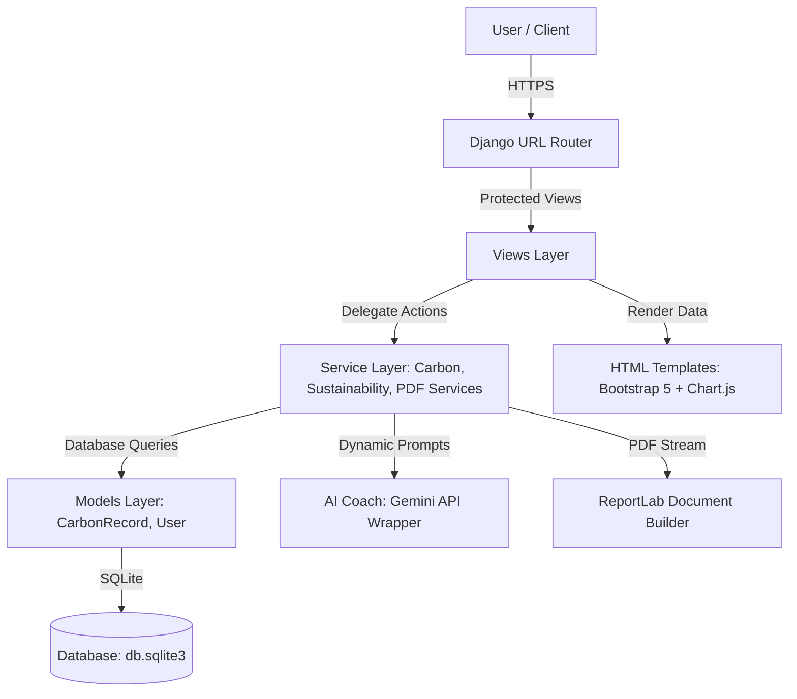

# 🌱 EcoTrack AI - Carbon Footprint Awareness Platform

EcoTrack AI is a production-grade Django web application designed to help individuals measure, track, and simulate changes in their carbon footprint. Powered by scientific emission factors, index-optimized database queries, and intelligent, personalized coaching, EcoTrack AI bridges the gap between environmental awareness and actionable sustainability.

---

## 🚀 Key Features

* **Authentication & Role Protection**: Secure user registration, login, and session-protected dashboards with secure cookie settings.
* **Carbon Footprint Calculator**: Instantly computes CO₂ emissions across transportation, electricity, diet, and waste using precise conversion metrics.
* **Intelligent Sustainability Coach**: Features an AI Sustainability Coach (integrates the new **Google GenAI SDK** and utilizes `'gemini-2.5-flash'`) to offer contextual, tailored lifestyle tips with a graceful, rule-based local fallback.
* **Interactive Analytics Dashboard**: Modern graphs (using Chart.js) visualizing historical trends, sector emission breakdowns, and dynamic sustainability scores (0-100).
* **Carbon Reduction Simulator**: A side-by-side lifestyle comparison tool that models prospective emission cuts and quantifies environmental impact.
* **PDF Sustainability Reports**: Generates professional, highly-styled ReportLab PDF summaries featuring executive overviews, data isolation, and trend history. Emojis have been fully cleaned to ensure standard Helvetica compatibility in all readers.
* **Premium SaaS UI Layout**: Built with a sleek slate-dark glassmorphism visual hierarchy, interactive animations, and responsive accessibility indicators (WCAG compliant).
* **Railway Integration Ready**: Fully pre-configured for automated Railway containerized builds, database migrations, and static assets hosting via Whitenoise.

---

## ⚡ Performance & Optimization Standards

* **Evaluation Caching**: Evaluates Django QuerySets to Python lists immediately in views, avoiding N+1 lookup database overhead.
* **Database Index Utilization**: Optimized monthly targets filtering using index range queries (`created_at__gte` and `created_at__lt`) rather than database-level year/month extracts, allowing indexing tools to execute search scans at maximum speed.
* **True Oldest Comparison**: Aggregated reduction statistics now query the absolute first database record (with ID tie-breaking logic) to compare historical changes accurately.
* **SEO & Heading Accessibility**: Implemented unique, descriptive SEO description meta tags on all endpoints and corrected header semantic structures to a single visible `<h1>` per page.

---

## 📊 Application Architecture



* **Separation of Concerns**: Business calculations and database aggregations are cleanly isolated into dedicated services (`calculator/services.py` and `dashboard/services.py`).
* **Optimized Performance**: Enforces database indexes on sorted logs querying fields (`created_at`) and uses Django `.only()` constraints to eliminate N+1 database queries.
* **Production Hardened**: Pre-configured with clickjacking protection, XSS filtering, secure CSRF cookies, and SSL header detection behind reverse-proxies.

---

## 📸 Screenshots Section

### Login & Registration Interface
<p align="center">
  
  &nbsp;
  
</p>

### Home & Calculator Inputs
<p align="center">
  
  &nbsp;
  
</p>

### Sustainability Dashboard & Trends
<p align="center">
  
  &nbsp;
  
</p>

### Carbon Reduction Simulator Comparison
<p align="center">
  
  &nbsp;
  
</p>

---

## ⚙️ Installation & Setup

### 1. Prerequisites
Ensure you have **Python 3.10+** installed.

### 2. Clone and Setup Environment
Clone the repository and configure your virtual environment:
```bash
# Clone the repository
git clone <repository_url>
cd carbonaware

# Create and activate virtual environment
python -m venv venv
# On Windows:
venv\Scripts\activate
# On macOS/Linux:
source venv/bin/activate

# Install dependencies
pip install -r requirements.txt
```

### 3. Environment Variables Config
Create a `.env` file in the root directory:
```bash
cp .env.example .env
```
Open `.env` and fill in the values:
```env
SECRET_KEY=your-custom-django-secret-key
DEBUG=True
ALLOWED_HOSTS=localhost,127.0.0.1
CSRF_TRUSTED_ORIGINS=http://localhost:8000
GEMINI_API_KEY=your-actual-gemini-api-key
```

### 4. Database Initialization
```bash
# Run migrations to build tables and indexes
python manage.py migrate

# Create an administrator account (optional)
python manage.py createsuperuser
```

### 5. Start Development Server
```bash
# Launch the web app
python manage.py runserver
```
Visit the application in your browser at `http://localhost:8000`.

---

## 🧪 Running Automated Tests

EcoTrack AI includes 29 comprehensive unit tests covering validation, calculations logic, views routing, login protection, safety isolation, and AI recommendations.
```bash
python manage.py test
```

---

## ☁️ Deployment Guide (Railway)

EcoTrack AI is fully prepared for zero-configuration deployments on Railway:
1. **Procfile**: Gunicorn WSGI startup configuration.
2. **build.sh**: Configured to install dependencies, collect static files and execute migrations automatically during deploy pipelines.
3. **Whitenoise**: Integrated for fast, reliable static file serving without external hosting.

### How and Where to add Deployment Environment Variables on Railway:

To ensure the production deployment handles routing, security, and live AI recommendations correctly, you need to add your environment variables inside the Railway Dashboard:

1. **Open the Railway Project**: Log into [Railway.app](https://railway.app/) and click into your project canvas containing your deployed service card.
2. **Select your Service**: Click on the specific service card matching your deployed repository (e.g. `carbonaware` or `carbonfootprint`).
3. **Navigate to the Variables Tab**: Inside the service management pane on the right-hand side, click on the **Variables** tab (located next to *Settings* and *Deployments*).
4. **Add Variables**: Click the **+ Add Variable** button to input each key-value pair, or use **Raw Editor** to copy-paste the values directly:
   
   Configure the following fields:
   * `SECRET_KEY`: *[A long, secure, randomized string]*
   * `DEBUG`: `False` (forces secure HTTPS flags and turns off debug pages)
   * `ALLOWED_HOSTS`: `<your-railway-domain>.up.railway.app`
   * `CSRF_TRUSTED_ORIGINS`: `https://<your-railway-domain>.up.railway.app`
   * `GEMINI_API_KEY`: *[Your active Gemini API key: e.g. AQ.Ab8R...]*

5. **Deploy**: Click **Save**. Railway will automatically trigger a redeploy of your application with the new configuration.

---

## 🗺️ Future Roadmap

- [ ] **Wearable Integration**: Integrate smart meter and wearable APIs (Strava, Fitbit) to log physical commutes automatically.
- [ ] **Community Goals**: Enable group challenges and global/local community leaderboards.
- [ ] **Offset Marketplace**: Connect users to verified carbon offset projects (gold standard reforestation, renewable investments).
- [ ] **Export to CSV/Excel**: Expand data exporting capabilities beyond PDF report downloads.
